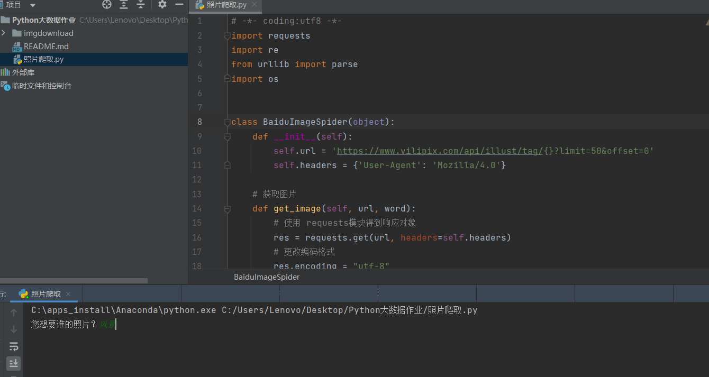
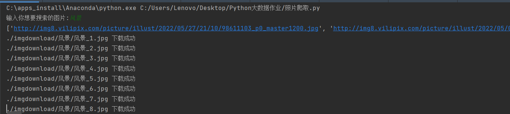
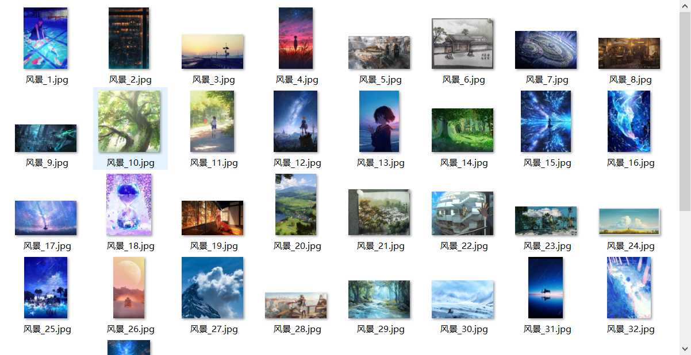
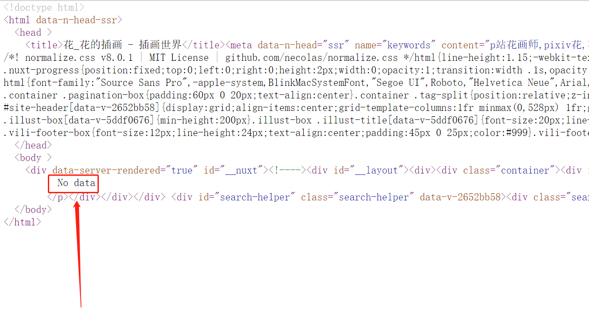
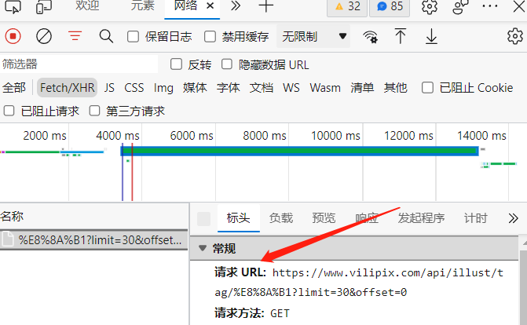
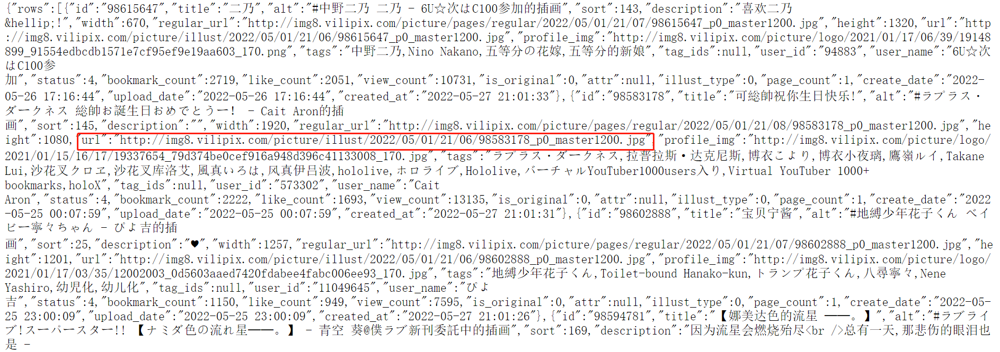

###python图片爬取脚本


####功能介绍：输入想要搜索的内容，会自动在该程序的路径下创建文件夹，并将你查询的照片结果自动下载到该程序内

####依赖环境
python3.8
requests re urllib os库

####爬取网站``` https://www.vilipix.com```

成果展示 


输入你需要的爬取的照片后自动进行下载，并保存到当前路径下的/imgdownload/搜索关键词的名字文件夹下，会进行检测，如果该文件夹不存在，则创建文件夹。

下载成功实例


##曾经遇到的问题
1.原本爬取的网页为
```https://www.vilipix.com/tags/%E8%8A%B1/illusts?p=2```
其中/tags/XXXXXXX/illusts XXXXX为本次搜索的内容，最初认为只需要修改XXXXX的内容就可以对网页进行爬取，对网页进行了检查，获取img的class为ei-img的类进行爬取，但是发现并没有爬取到图片，于是对网页进行了检查源代码如图
推测设置了反爬虫设置，网页为动态加载，禁止了轻而易举的爬虫
在检查了```https://www.vilipix.com/robots.txt```
内容为:
User-agent: Googlebot
Disallow: / 
发现没有禁止个人爬虫，因此开始检查网页的内容出处

通过检查浏览的的控制台->network->xhr 并刷新网页

成功找到了对应的正确的url

使用正则表达式 
``` pattern = re.compile('"url":"(.*?)"', re.S)```
成功捕获
接下来就是将照片保存的小程序所在的地址就成功了
